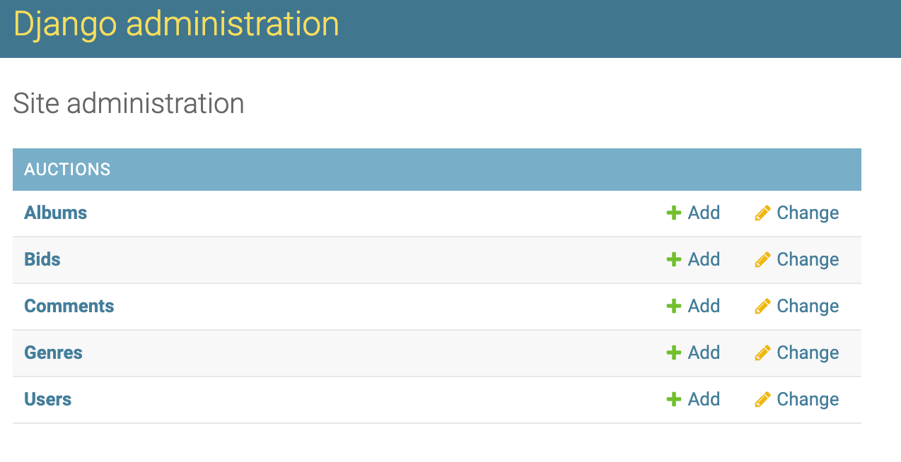

# RockUrFace Marketplace

## The Classic Albums Auction Site

### A **Python/Django** Web App for buying and selling classic albums

## Welcome

Do you dig tunes? RockUrFace Marketplace is a Full Stack Python/Django eCommerce site for auctioning albums. With an attractive, responsive user interface, you can post your albums, bid on others, or just browse and enjoy the selection.

The RockUrFace Marketplace site runs on a SQLite database consisting of these tables:
- Albums (including Title, Artist, Year, Description, and linked to Users who posted and bid on the album, and multiple Genres and multiple Watchers for each album, which allows users to maintain a 'Watchlist' of albums)
- Users (including Username, hashed Password)
- Genres (including name and description)
- Bids (including amounts, each linked to a particular Album and User)
- Comments (including comment text and datetime, each linked to a particular Album and User)

RockUrFace Marketplace originated as a [project](https://cs50.harvard.edu/web/2020/projects/2/commerce/) for Harvard's [CS50 Web Programming course](https://cs50.harvard.edu/web/2020/).

## Video Walkthrough

## Want to try it out?

First, you'll need to [clone the repository](https://docs.github.com/en/repositories/creating-and-managing-repositories/cloning-a-repository).

Next, make sure that you have [Python](https://www.python.org/downloads/) installed.

If you don't have Django installed, run `pip3 install django` in your terminal.

Then, in your terminal, navigate to the cloned directory and enter `python manage.py migrate` (or `python3 manage.py migrate`)
This should initialize a SQLite3 database file for your albums.

Next create a superuser: `python manage.py createsuperuser` (or `python3 manage.py createsuperuser`)
Follow the prompts to create a superuser account.

Now, enter `python manage.py runserver` (or `python3 manage.py runserver`)
This will open the development server. In your browser, visit the url provided to see the site in action!

I would recommend starting by adding "/admin" to the end of the url and logging in with your superuser account.

On this screen, use the "+Add" button to the right of "Genres" to add some genres (Rock, Hip Hop, Soul etc.) to your database. You can also come back and do this later, and make any changes to Albums, Bids, Comments, Genres, and Users here in admin!

If you're ready, click "View Site" in the upper right corner (or navigate back to the site URL) and have fun creating users, posting albums, bidding, and selling. The video walkthrough above gives a tour of the site.

Rock on! 🎸 🎹 🥁 🎙️ 🎚️ 🧑‍🎤

### This project was built with

- Python
- Django
- SQLite3
- Bootstrap
